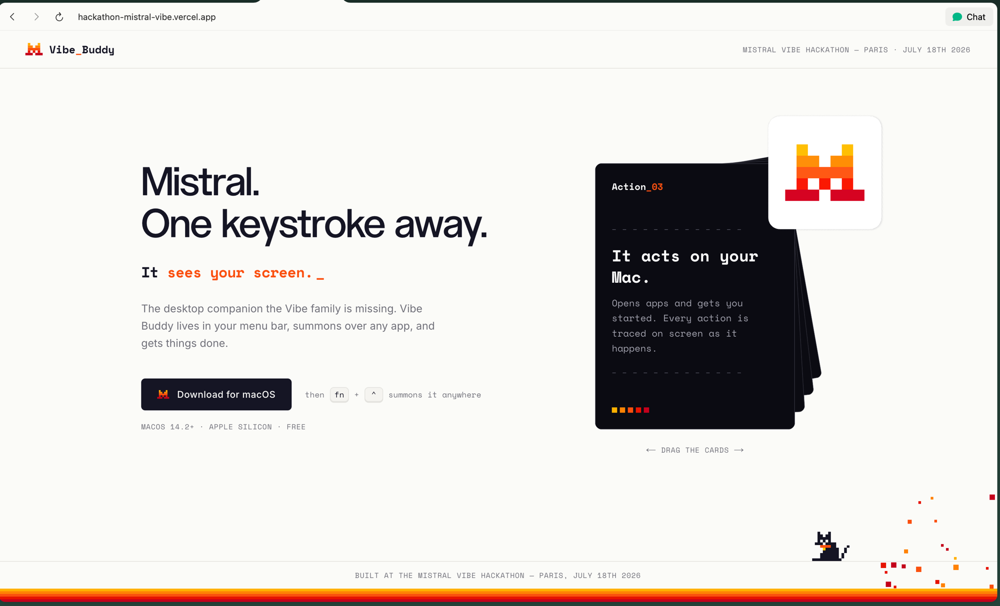
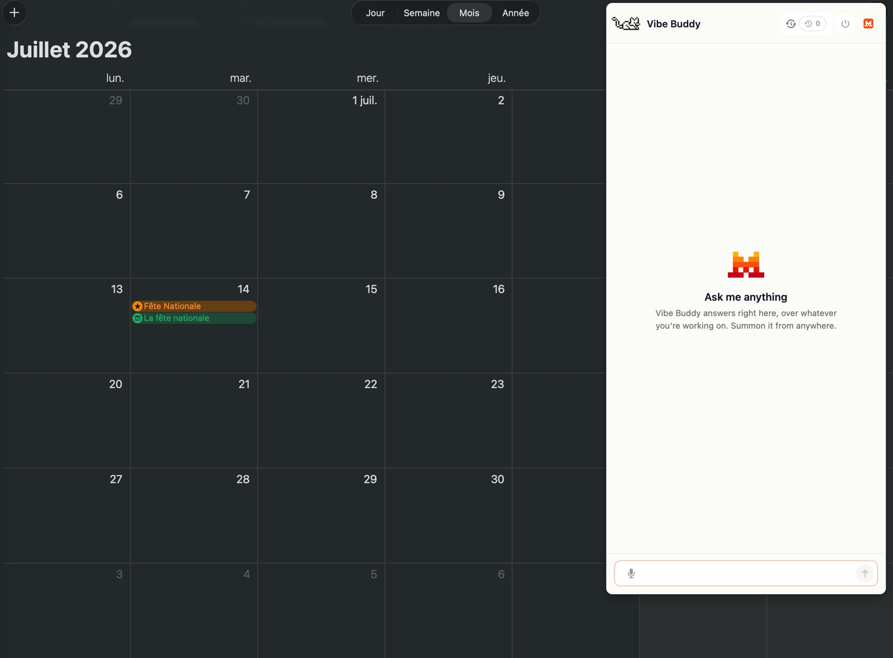
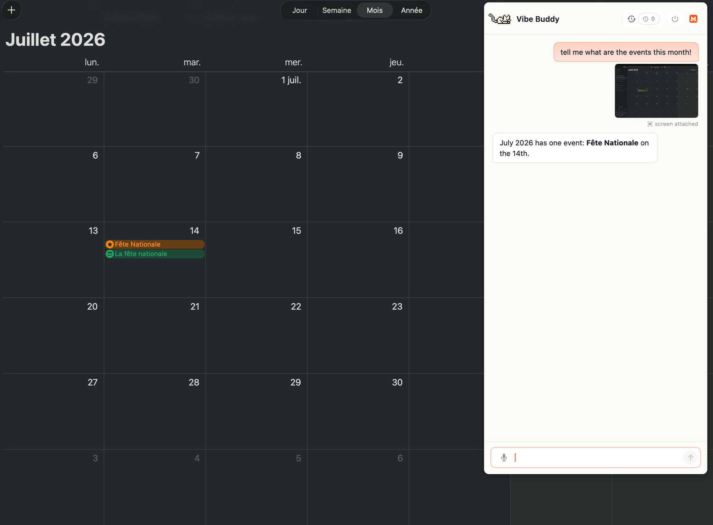

# Vibe Buddy

**Mistral. One keystroke away.**

The desktop companion the Vibe family is missing. Vibe Buddy is a macOS menu-bar app that summons over any application with a single hotkey, sees your screen, answers with Mistral, and acts on your Mac — with every action traced on screen as it happens.

Built in one day at the **Mistral Vibe Hackathon — Paris, July 18th 2026**.



## Why

The desktop is where work happens, and Mistral isn't there. ChatGPT and Claude sit in the macOS menu bar, one keystroke from every workflow; Mistral users open a browser tab. Vibe Buddy closes that gap: an ambient, always-available Mistral surface that lives in the menu bar and summons anywhere.

## What it does



- **Summon from anywhere** — press `fn + control` over any app and the panel appears in under a second (CGEvent listen-only tap on modifier flags; menu-bar-only app, no Dock icon).
- **It sees your screen** — a screenshot is captured at summon time (ScreenCaptureKit) and attached to your question as visual context. You can see it pinned to your message, and opt out.
- **It talks Mistral** — replies stream in from **Mistral Medium 3.5** via SSE, through a key-holding proxy.
- **Voice input via Voxtral** — push-to-talk records your question, the worker transcribes it with `voxtral-mini-latest`, and the transcript lands in the same input path as typed text (Apple Speech stays as the on-device fallback).
- **It acts on your Mac** — the model ends its reply with an action token (`[OPEN_APP:Name]` / `[OPEN_URL:...]`); the app parses it, opens the target via NSWorkspace, and draws an overlay trace. **Nothing ever acts invisibly** — actuation has no other code path, by design.
- **Routines** — user-defined prompts on a schedule (in-app scheduler, JSON in UserDefaults), running through the same chat path and surfacing results as native macOS alerts.
- **Vibe Code sessions strip** — a read-only view of your live local Vibe Code CLI sessions (title / cost / status), tying the buddy to the rest of the Vibe lineup.
- **"Hey Vibe" wake word** *(stretch)* — a custom openWakeWord model in a Python sidecar summons the panel hands-free.



## How it works

```
fn+control ──► panel summons (NSStatusItem + KeyablePanel, over any app)
     │
     ├─ voice: push-to-talk mic ──► POST /transcribe (multipart WAV) ──► Voxtral ──► transcript
     │
     ▼
ScreenCaptureKit JPEG + user text ──► POST http://127.0.0.1:8787/chat  (SSE)
                                            │
                              Cloudflare Worker (holds the API key)
                                            │
                             Mistral /v1/chat/completions (stream)
                                            │
     chunks stream back ◄── {"type":"delta"} … {"type":"done"} ◄────────┘
     │
     └─ trailing [OPEN_APP:Name] token ──► NSWorkspace.open + on-screen overlay trace
```

Two hard rules shape the architecture:

1. **No secrets in the app.** Every Mistral call goes through the Cloudflare Worker proxy; API keys live in `worker/.dev.vars` only. The Swift app never sees a provider format or an auth header.
2. **No invisible actions.** Actuation fires only from a parsed action token inside an active session, and always draws its overlay. There is no silent path.

Everything crossing a boundary is parsed before it's trusted: SSE events go through `SSEEventParser`, action tokens through `ActuationTokenParser`.

### Demo safety: replay mode

The worker ships a `DEMO_MODE=live|replay` switch (default: `replay`). Replay serves recorded SSE fixtures — byte-identical in shape to live traffic, streamed at realistic pace — so the demo can never die on venue wifi or a rate limit. In live mode, every upstream call is time-boxed (60 s, one retry) and falls back to the fixture instead of erroring. The `x-vibe-source` response header tells you what really served each reply, and an `x-demo-mode` request header overrides the mode per call.

## Repository layout

```
app/        Swift 5 / SwiftUI menu-bar app (Xcode project, macOS 14.2+)
│           ├─ CompanionManager        permissions + dictation state machine
│           ├─ VibeBuddyChatController transcript + stream pipeline
│           ├─ ActuationExecutor       [OPEN_APP:] → NSWorkspace + overlay
│           ├─ RoutineScheduler/Store  scheduled prompts → native alerts
│           └─ wakeword/               "Hey Vibe" openWakeWord sidecar (stretch)
worker/     Cloudflare Worker proxy (TypeScript + wrangler)
│           └─ src/index.ts            /chat (Mistral SSE translate) + /transcribe (Voxtral) + /health
landing/    Next.js landing page + downloadable .dmg  →  hackathon-mistral-vibe.vercel.app
fixtures/   Recorded SSE replies, screenshot/voice fixtures — the replay corpus
scripts/    smoke.sh — the demo-path smoke test
docs/       Product context, plans, demo walkthrough
```

`PRODUCT.md` is the product source of truth (pitch, MUSTs, demo script); `AGENTS.md` is the engineering source of truth (stack, contracts, decision log).

## Getting started

### 1. Run the worker (required first)

```bash
cd worker
cp .dev.vars.example .dev.vars        # paste your MISTRAL_API_KEY (live mode only)
npx wrangler dev                      # http://127.0.0.1:8787
```

```bash
curl -s http://127.0.0.1:8787/health
# {"ok":true,"mode":"replay","model":"mistral-medium-3-5"}
```

No key? No problem — replay mode serves recorded fixtures with zero network calls.

### 2. Run the smoke test

```bash
bash scripts/smoke.sh                 # replay — run after every change
DEMO_MODE=live bash scripts/smoke.sh  # against the real Mistral API (costs credits)
```

The smoke script exercises the full demo path: `/chat` with an image fixture, the `[OPEN_APP:]` actuation round-trip, and `/transcribe` with a voice fixture.

### 3. Run the app

Open `app/leanring-buddy.xcodeproj` in Xcode 15+, set your signing team (Signing & Capabilities → personal team works), and hit ⌘R.

On first run, grant the permissions the app asks for — all three are required for the full experience, and macOS re-prompts after every rebuild (the build signature changes):

| Permission | Used for |
|---|---|
| Accessibility | the global `fn + control` modifier-only hotkey |
| Screen Recording | the summon-time screenshot context |
| Microphone | push-to-talk voice input |

Then press `fn + control` from anywhere.

### API endpoints (worker contract)

| Endpoint | What it does |
|---|---|
| `POST /chat` | `{messages, screenshot_base64}` in → `{"type":"delta"}` / `{"type":"done"}` SSE out |
| `POST /transcribe` | multipart 16 kHz mono WAV → `{"text": "transcript"}` via Voxtral |
| `GET /health` | `{"ok":true,"mode":"replay|live","model":"mistral-medium-3-5"}` |

The full wire contract lives in [`worker/CONTRACT.md`](worker/CONTRACT.md).

## Landing page

A one-page site with the pitch, draggable feature cards, and the downloadable signed `.dmg` — live at [hackathon-mistral-vibe.vercel.app](https://hackathon-mistral-vibe.vercel.app).

```bash
cd landing && npm install && npm run dev
```

## Stack

| Layer | Choice |
|---|---|
| Desktop app | Swift 5 / SwiftUI menu-bar app (`LSUIElement`), macOS 14.2+, Apple Silicon |
| Proxy | Cloudflare Worker, plain TypeScript + wrangler |
| Chat / vision / actuation | Mistral Medium 3.5 (`mistral-medium-3-5`) |
| Speech-to-text | Voxtral (`voxtral-mini-latest`) |
| Wake word (stretch) | custom openWakeWord model, Python sidecar |
| Landing | Next.js + Tailwind, deployed on Vercel |

## Team

Built by **Mathis** (worker / agentic layer, fixtures, landing page, product) and **Edouard** (the entire Swift app) in one hackathon day.

The menu-bar scaffold builds on [Clicky](app/LICENSE-clicky) (MIT — attribution kept).
